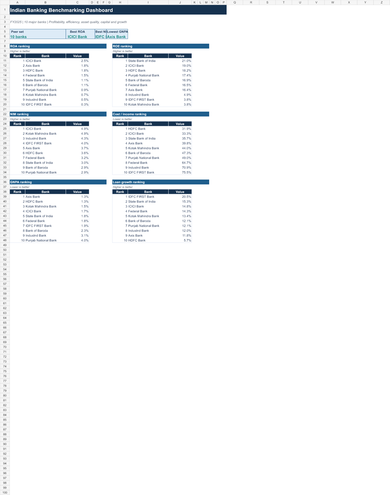
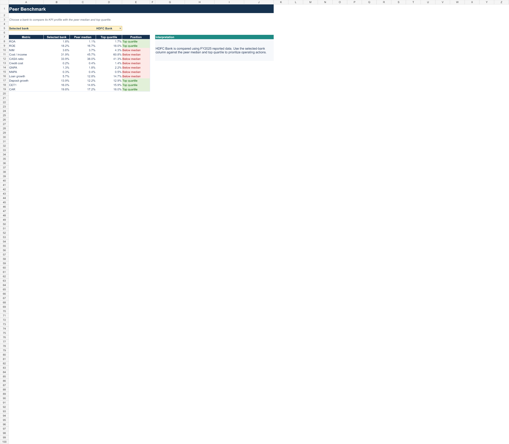

# Indian Banking Benchmarking Dashboard

A formula-driven FY2025 benchmarking model for 10 major Indian banks. The project compares profitability, operating efficiency, funding, asset quality, capital strength and growth using a consistent peer framework.



## What is included

- **Executive Dashboard** — rankings for ROA, ROE, NIM, cost / income, GNPA and loan growth.
- **Bank Comparison** — full KPI comparison across the peer group.
- **Peer Benchmark** — select one bank and compare it with peer median and top quartile.
- **Opportunity Analysis** — formula-led gap assessment and action focus.
- **First-time guide** — a visual poster explaining how to interpret the dashboard.

## Bank universe

HDFC Bank, ICICI Bank, State Bank of India, Axis Bank, Kotak Mahindra Bank, IndusInd Bank, Bank of Baroda, Punjab National Bank, Federal Bank and IDFC FIRST Bank.

## Quick start

1. Open `dashboard/indian_banking_benchmarking_dashboard.xlsx` in Excel desktop.
2. Start on **Executive Dashboard** to identify leading and lagging metrics.
3. Use **Bank Comparison** to test whether an apparent strength has a trade-off in funding, asset quality or capital.
4. Choose a bank on **Peer Benchmark**. The selector compares it with the peer median and top quartile.
5. Read **Opportunity Analysis** for the quantified gap and suggested action focus.



## KPI framework

| Area | Metrics |
| --- | --- |
| Profitability | NIM, ROA, ROE, net profit |
| Efficiency | Cost / income, operating expense, employee productivity proxy |
| Funding | Deposits, CASA, deposit growth |
| Asset quality | GNPA, NNPA, provision coverage ratio, credit cost |
| Capital | CET1, Tier 1 and capital adequacy ratio |
| Growth | Loan growth and deposit growth |

See [methodology](docs/methodology.md) for formula definitions and comparability notes.

## Example insights

- A bank with high loan growth but slower deposit growth may be increasing its funding risk.
- A high NIM is more valuable when GNPA and credit cost remain controlled.
- A low cost / income ratio can indicate operating leverage, but should be assessed alongside growth and service capacity.
- A high capital ratio can support growth, while weak profitability may dilute returns on that capital.

## Data and sources

The source dataset is available in `data/processed/banking_benchmark_fy25.csv`. Bank-level figures are compiled from FY2025 annual reports and Q4 investor presentations. Links are maintained in [sources.md](docs/sources.md). Amounts are in ₹ crore unless otherwise stated.

The project is designed for analytical learning and benchmarking. Reporting basis, definitions and disclosure scope may differ by bank. Refresh and reconcile inputs against the relevant filing before using the material for investment, credit or business decisions.

## Refreshing the model

Follow [refresh_data.md](scripts/refresh_data.md) when publishing a new reporting year. Retain the raw filing, record the source URL and page, standardise units, and refresh the workbook inputs before reviewing dashboard results.

## Repository structure

```text
├── dashboard/       Excel model and first-time guide
├── data/            raw-source guidance, processed dataset and data dictionary
├── docs/            methodology, glossary, sources and findings
├── screenshots/     dashboard previews for GitHub
└── scripts/         repeatable refresh instructions
```

## License

This project is released under the [MIT License](LICENSE).
